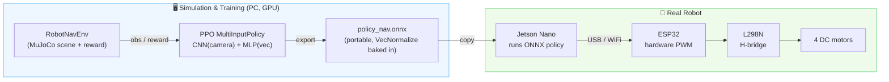
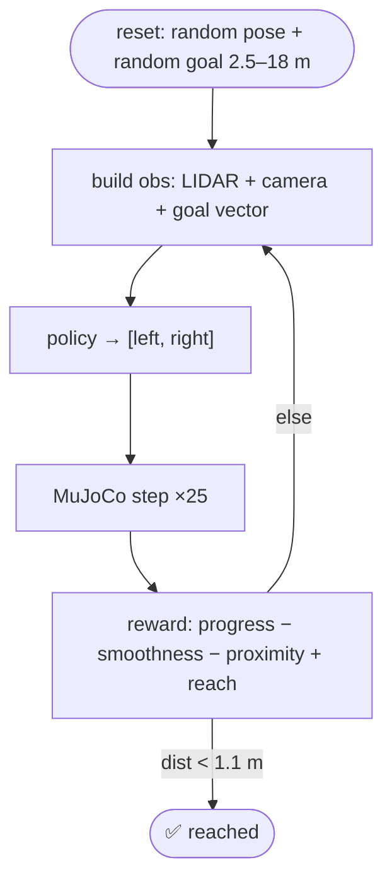
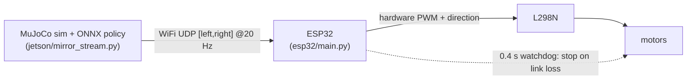
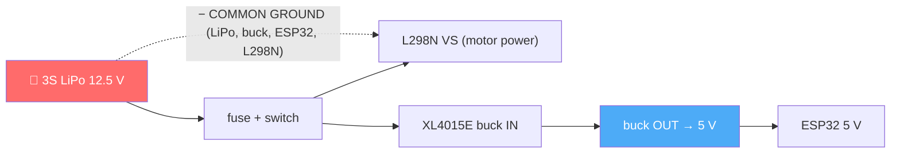
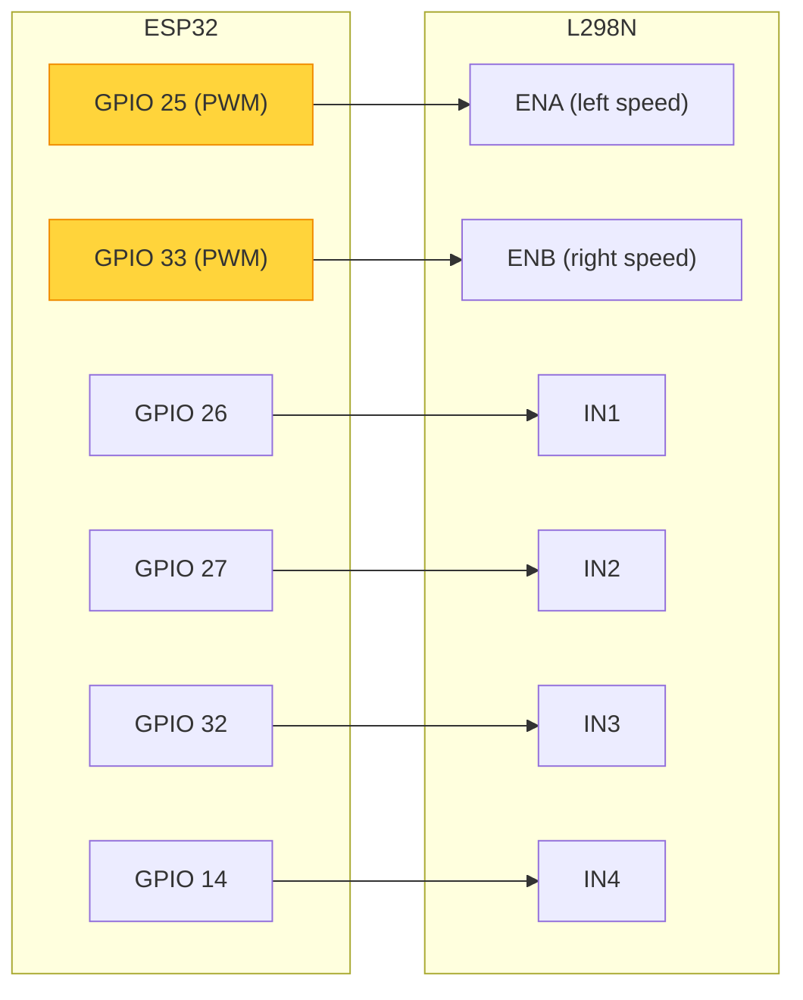

# 🤖 personalRobot — Sim-to-Real RL for a 4-Wheeled Robot

> Train a robot designed in **Onshape** to navigate with **reinforcement learning** in simulation, then
> run the *same* trained brain on the **real hardware** — over WiFi, on real motors.

<p>
   
</p>

A 4-wheeled skid-steer robot learns **point-to-point navigation** (drive from anywhere to a commanded
goal, avoiding obstacles) using a **2D LIDAR + onboard camera as complementary senses**. The policy is
trained in MuJoCo with PPO, exported to a portable **ONNX** file, and executed on the real robot — the
**Jetson Nano** as the brain and an **ESP32** as the motor controller.

---

## ✨ What it does

- **Learns to navigate** in sim: from a random pose, drive to a commanded waypoint while avoiding up to 4 obstacles.
- **Two senses, working together** — a 24-ray **LIDAR** (360° obstacle sense) *and* a 64×64 **camera** (forward view), fused by a CNN+MLP policy.
- **Smooth, hardware-friendly motion** via CAPS-style action-smoothness rewards (no twitchy, motor-wearing control).
- **Runs on real hardware** — the trained ONNX policy drives real motors, live over WiFi.

---

## 🏗️ System architecture



---

## 🧠 The RL task

| Element | Definition |
|---|---|
| **Observation** | `Dict{ vec: 32, img: 64×64×3 }` |
| &nbsp;&nbsp;• `vec` | goal `[dist, cos/sin(heading err)]` + robot `[vx, vy, yaw_rate]` + `last_action[2]` + **24 LIDAR** ranges |
| &nbsp;&nbsp;• `img` | forward **camera** (fed to a CNN) — a *complementary sense* alongside the LIDAR |
| **Action** | `[left, right]` wheel commands ∈ [-1, 1] (skid-steer) |
| **Reward** | `+progress +heading −proximity −collision −lateral −bounce −rate −accel +reach` |
| **Curriculum** | distance warmup (near→far) → 1 → 2 → 3 → 4 obstacles, auto-promoted on success rate |

The **camera and LIDAR are both senses of the car** — the LIDAR gives 360° obstacle geometry, the camera
adds a forward visual view; the policy learns to use both together.



---

## 🔄 Sim-to-real pipeline

The **mirror** streams the sim policy's commands to the real robot so you can *watch* the trained brain
drive the physical machine. The **same ONNX** later runs onboard for full autonomy.



> The Jetson Nano's native PWM is unreliable for two motors (a known limitation), so an **ESP32 running
> MicroPython** is the motor co-processor. For the mirror, the PC talks to the ESP32 directly over WiFi.

---

## 🔌 Hardware & wiring

**Power** — one 3S LiPo runs everything:



**Signals** — ESP32 → L298N (jumpers OFF; PWM does the speed):



Full details, safety, and power math: **[`docs/wiring.md`](docs/wiring.md)**.

---

## 📁 Repository structure

```
personalRobot/
├── mujoco_car/           # RL pipeline (the only place experiments live)
│   ├── nav_config.py     #   ⭐ single source of truth: arena, obstacles, curriculum, paths
│   ├── robot_env_nav.py  #   Gymnasium env (Dict obs, smooth-motion reward)
│   ├── train_nav_curriculum.py  #   PPO curriculum trainer
│   ├── watch_nav.py / record_nav.py  #   live viewer / video recorder
│   ├── export_onnx.py    #   SB3 → portable ONNX (deploy seam)
│   ├── mj_utils.py       #   shared MuJoCo helpers
│   └── test_nav_env.py   #   env + scene-consistency tests
├── robot/                # MuJoCo model + scene (Onshape export → robot.xml, train_scene_nav.xml, meshes)
├── models/               # 📦 tracked deployable policy (policy_nav.onnx + norm stats)
├── esp32/                # ESP32 MicroPython motor firmware + WiFi mirror
├── jetson/               # on-robot deploy + PC-side sim mirror
├── ros2_nav/             # ROS 2 interface (hardware-agnostic policy node + sim bridge)
├── docs/                 # wiring guide, notes
└── artifacts/            # (gitignored) checkpoints, tensorboard, filmstrips, videos
```

---

## 🚀 Quickstart

```bash
conda activate isaaclab            # env with mujoco, stable-baselines3, torch, onnxruntime…
pip install -e .                   # clean imports (no PYTHONPATH needed)

# Train (curriculum, ~1.5–2 h) — checkpoints + filmstrips land in artifacts/
MUJOCO_GL=egl python mujoco_car/train_nav_curriculum.py 6000000

# Watch it drive (live viewer, hot-reloads the training checkpoint)
python mujoco_car/watch_nav.py --stage 2

# Export the trained policy to ONNX (models/policy_nav.onnx)
python mujoco_car/export_onnx.py

# Sim-to-real mirror → real robot over WiFi (wheels off the ground!)
python jetson/mirror_stream.py --host <esp32-ip> --stage 2 --smooth 0.5
```

Run the tests: `MUJOCO_GL=egl python mujoco_car/test_nav_env.py`

---

## 🗺️ Custom maps & 3D terrains

The world is a **MuJoCo MJCF scene** (`robot/train_scene_nav.xml`) — everything is customizable. Three ways to bring in your own map or terrain:

**1. Change the arena / obstacles (easiest).**
Arena size, obstacle size/count, and the curriculum live in one place — **`mujoco_car/nav_config.py`**. Edit `ARENA`, `OBS_HALF`, `STAGES`, etc. (the `test_config_matches_scene` test guards against drift with the XML).

**2. Import a 3D model (OBJ/STL) as terrain or objects.**
MuJoCo loads meshes just like the robot's own parts (`robot/assets/*.stl`). Add to the scene XML:
```xml
<asset>
  <mesh name="my_terrain" file="assets/my_terrain.stl"/>
</asset>
<worldbody>
  <geom type="mesh" mesh="my_terrain" pos="0 0 0"/>
</worldbody>
```
Export from Blender/CAD as STL or OBJ into `robot/assets/`. (Keep collision meshes simple/convex — MuJoCo decomposes concave meshes poorly; use primitive geoms or convex hulls for collision, the detailed mesh for visual.)

**3. Heightfield terrain (ramps, hills, rough ground) from an image.**
MuJoCo's `<hfield>` turns a grayscale PNG into 3D terrain:
```xml
<asset>
  <hfield name="ground" file="assets/heightmap.png" size="20 20 1.5 0.1"/>
</asset>
<worldbody>
  <geom type="hfield" hfield="ground" pos="0 0 0"/>
</worldbody>
```
`size = radius_x radius_y max_height base` — a painted heightmap becomes drivable terrain the wheels feel.

**Textures** (`<texture>` + `<material>`) change how the world *looks* — which matters because the **camera sees it**, so richer/varied textures make the visual sense more meaningful.

> 📌 After changing the world, rerun `python mujoco_car/test_nav_env.py` to catch any Python↔XML mismatch, and retrain (the policy is tied to the geometry it learned on).

---

## 📊 Results

| Policy | Success (0 / 2 / 4 obstacles) | Motion smoothness (action-rate ↓) |
|---|---|---|
| Baseline nav | 87 / 67 / 50 % | 0.28 (twitchy) |
| **+ smoothness reward** | 47 / 50 / 57 % | **0.14 (≈2× smoother)** |

Deployed and verified on the real robot: the ESP32 drives the motors from the trained policy over WiFi, with visibly calmer motion.

---

## 🛣️ Roadmap

- **Richer world:** obstacles that deliberately block the path, heightfield terrain, moving obstacles.
- **Domain randomization** (textures, lighting, sensor noise, latency) for tougher sim-to-real transfer.
- **Distance-gated smoothness:** relax the smoothness penalty near obstacles for crisp avoidance *and* smooth cruising.
- **Onboard autonomy:** real LIDAR + camera + wheel-encoder/IMU odometry feeding the ONNX policy on the Jetson (the ROS 2 node in `ros2_nav/` is already the hardware-agnostic seam).

---

## Why MuJoCo (not Isaac Sim)?

Isaac Sim's RTX renderer crashes/hangs on this RTX 5060 Ti (Blackwell) GPU. MuJoCo uses plain OpenGL/EGL,
works perfectly, and its portable ONNX export makes on-device deployment clean.
